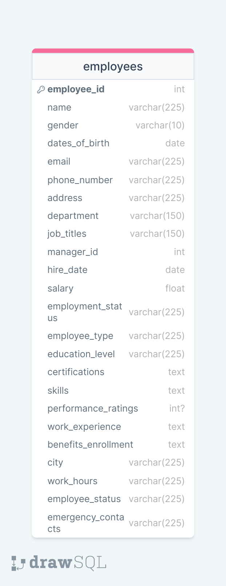

# Fake Employee Generator Using Python and Faker Library

## Project Description:
>Generating fake or synthetic data serves various important purposes for data engineers, especially in scenarios where access to real data might be limited,
>sensitive, or unavailable due to privacy concerns. Some key reasons for generating fake data include:

## Objectives:
>The aim of this project is to create a versatile, reliable, and comprehensive dataset that meets the requirements for analysis, testing, development, and compliance while safeguarding sensitive information.

## Tools used:
* Python Programming Language
* Postgres Database
* DBeaver
* Canvas (for design)

## Module / Library Used:
* random
* Faker
* psycopg2
* Pandas

## Data Dictionary / Model

Creating a robust employee dataset for data analysis and visualization involves several key fields that capture different aspects of an employee's information. Here's a list of fields you might consider including:
